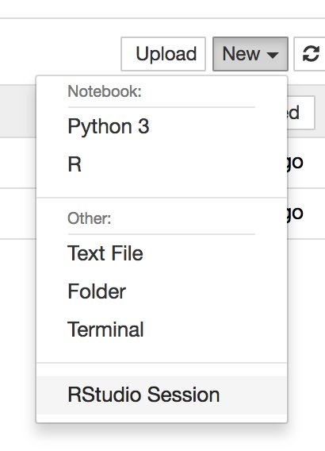

[](https://github.com/joethorley/stability-badges#experimental)
[](https://travis-ci.org/rocker-org/binder)
[](https://hub.docker.com/r/rocker/binder) [](https://hub.docker.com/r/rocker/binder/builds)
<!-- [](https://microbadger.com/images/rocker/binder) --> 


  

# rocker/binder

Adds [binder](http://mybinder.org/) abilities on top of the `rocker/tidyverse` images. 


## Deploy methods


### Using Docker


_This approach works on any machine on which you have Docker installed._

The `rocker/binder` images can be run like any other docker image:

```
docker run -p 8888:8888 rocker/binder
```

Note that binder will run Juyter Notebook on port `8888` by default.  The above
command will print to the terminal (and the docker container log) the URL
which includes a randomly generated token for secure login, so be sure to
include that in the URL you paste into the browser.


Once inside Jupyter Notebook, RStudio Server should be an option under the menu
"New":



That should start you into an RStudio session (with no further login required).


### Using beta.mybinder.org services

_This approach uses the public binder cloud and requires no installation_


Add a Dockerfile with the following contents to the root of a GitHub
repository.  
 

```bash
FROM rocker/binder:3.4.2
```

Extend as necessary (see below).  Then go to <beta.mybinder.org> and enter the
`https` address of your repository to launch your instance on the public Binder
infrastructure.


##### Details


The `3.4.2` indicates the version of R requested. Use a specific version to ensure a consistent build environment or use `latest`
to get the latest avialable version of R and R packages.     

No additional lines are needed unless you want to install further libraries. In
that case, you will need to first switch to root user to run `apt-get`, and then
switch back to `$NB_USER` (`rstudio`) to keep JupterHub startup happy.
For instance, say you want to install from `apt-get` or populate the repo files to the default directory:

```bash
FROM rocker/binder:3.4.2

USER root
RUN apt-get update && apt-get -y install libv8-dev

COPY . /home/rstudio/
RUN chown -R rstudio:rstudio * .*

USER rstudio
```

See https://github.com/binder-examples/dockerfile-rstudio for a minimal example.

## Credits

* [Ryan Lovett](http://github.com/ryanlovett) for writing the core part of this,
  [nbrsessionproxy](http://github.com/jupyterhub/nbrsessionproxy).
* [Taylor Reiter](https://github.com/taylorreiter) for testing & shaping this.
* [Yuvi Panda](https://github.com/yuvipanda) & [Aaron Culich](http://github.com/aculich) for bringing it together on Binder.
* [Chris Holdgraf](http://github.com/choldgraf/) for this [nice GIF](https://twitter.com/choldgraf/status/921165684188393472)
* [Tim Head](https://github.com/betatim) for this [nice GIF](https://twitter.com/betatim/status/921156659166277634)

